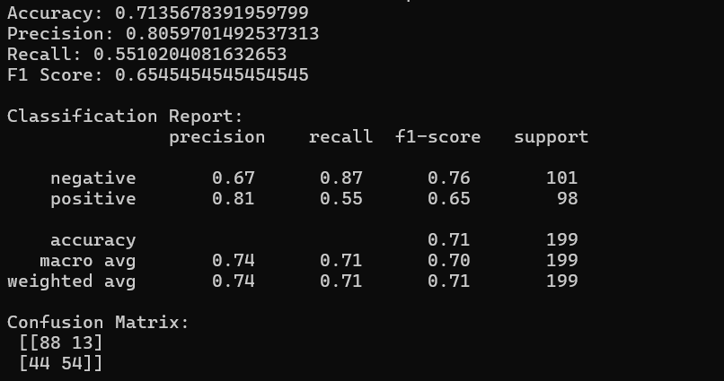

# Sentiment Analysis with LSTM

This project demonstrates how to classify movie reviews as positive or negative using an LSTM-based neural network built with Keras.

## 📌 Features
- Data preprocessing with NLTK
- Word embedding and padding
- LSTM model implementation
- Accuracy, Precision, Recall, F1 Score metrics
- Confusion matrix visualization

## 🚀 Tech Stack
- Python 3.x
- TensorFlow/Keras
- Pandas, NumPy, NLTK
- Scikit-learn

## 📊 Results
The model achieved satisfactory performance metrics on the test set. Evaluation outputs include classification report and confusion matrix.

## 📷 Sample Output

## 🔧 How to Run
1. Clone the repo  
2. Install required packages 
3. Run the notebook `Sentiment-Analysis-LSTM.ipynb`

## 📁 Dataset
The dataset used (`movie_reviews.csv`) should contain at least two columns: `review` and `sentiment`.

## 💡 Future Improvements
- Use pre-trained embeddings (e.g., GloVe)
- Tune hyperparameters
- Deploy via Streamlit or Flask
